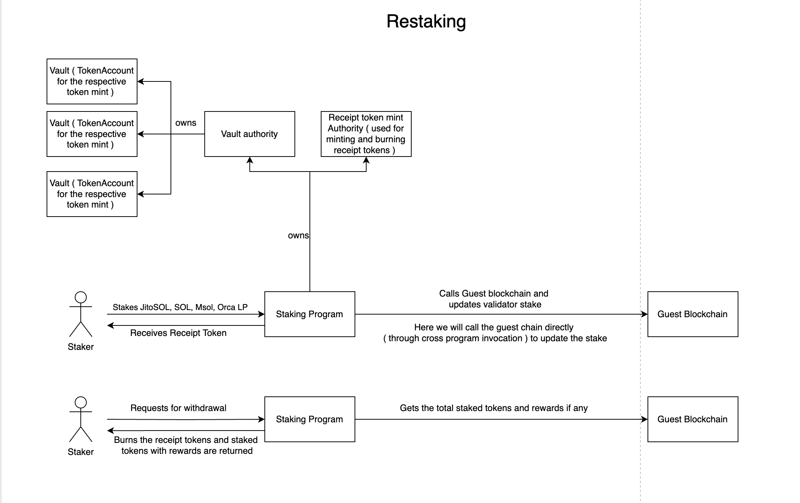

# Restaking

The high level flow of the program is given in the image below.

## Accounts

- Vaults: The vaults are created for each whitelisted token. Vaults
  are token accounts. The authority of the account is a PDA which
  means the program controls the vault and any debit from the vault
  has to go through the smart contract.

- Receipt Token Mint: The receipt token mint is a NFT which is the
  seed for the PDA storing information about stake amout, validator
  and rewards. For more information, refer:
  https://docs.composable.finance/technology/solana-restaking/vaults/#receipt-token

- Staking Params: This is a PDA which stores the staking parameters
  and also is the authority to `Receipt Token Mint` and `Vaults`.

- Vault Params: PDA which stores the vault params which are stake time
  and service for which it is staked along with when rewards were
  claimed.

## Instructions

When the contract is deployed, the `initialize` method is called where
the whitelisted tokens, admin key and the rewards
token mint is set. Initially the `guest_chain_initialization` is set to
false. Any update to the staking paramters can only be
done by the admin key. A token account is also created for the
rewards token mint which would distribute the rewards. Since the
authority is PDA, any debit from the account will happen only through
the contract (only in `claim` method for now). After that the users
can start staking.

- `Deposit`: User can stake any of the whitelisted token. The tokens
  are stored in the vault and receipt tokens are minted for the user.
  A CPI (cross program invocation) call is made to the guest chain
  program where the stake is updated for the validator specified.

- `Withdrawal Request`: Users can request for withdrawal and after the
  unbonding period gets over, the tokens would be withdrawn. In this method,
  the receipt NFT would be transferred to an escrow account and the receipt
  NFT token account would be closed. All the pending rewards are transferred
  in this method and users wont be eligible for rewards during the unbonding
  period.

- `Cancel Withdrawal Request`: Withdrawal request set by the user can be 
  cancelled as long at they are under unbonding period or if the withdraw 
  has not been executed yet. They would get back their receipt token and 
  withdrawal request would be cancelled.

- `Withdraw`: Users can only withdraw their tokens after the unbonding
  period ends. When user wants to withdraw the tokens, final stake amount
  is fetched from the guest chain. The receipt token is burnt. A CPI call
  is made to the guest chain to update the stake accordingly.

- `Claim Rewards`: Users can claim rewards without withdrawing their
  stake. They would have to have to own the non fungible receipt
  token to be eligible for claiming rewards.

- `Set Service`: Once the bridge is live, users who had deposited before
  can call this method to delegate their stake to the validator. Users
  cannot withdraw or claim any rewards until they delegate their stake
  to the validator. But this method wont be needed after the bridge is
  live and would panic if called otherwise.

- `Update Guest chain Initialization`: The admin would call this method
  when the bridge is up and running. This would set `guest_chain_program_id`
  with the specified program ID which would allow to make CPI calls during
  deposit and set stake to validator.

- `Update token Whitelist`: The admin can update the token whitelist.
  Only callable by admin set during `initialize` method.

- `Withdraw Reward Funds`: This method is only callable by admin to
  withdraw all the funds from the reward token account. This is a
  safety measure so it should be called only during emergency.

- `Change admin Proposal`: A proposal set by the current admin for 
  changing the admin. A new admin is proposed by the existing admin
  and the until the new admin approves it in `accept_admin_change`,
  the admin wont be changed.

- `Accept admin change`: The new admin set by the existing admin is
  exepected to call this method. When the new admin calls this method,
  the admin is changed.

- `Update Staking Cap`: Method which sets the staking cap which limits
  how much total stake can be set in the contract. This method expects
  the staking cap to be higher than previous to execute successfully.

## Verifying the code

First, compile the programs code from the `emulated-light-client` Github
repository to get its bytecode.

    git clone https://github.com/ComposableFi/emulated-light-client.git
    anchor build

Now, install the [Ellipsis Labs verifiable
build](https://crates.io/crates/solana-verify) crate.

    cargo install solana-verify

Get the executable hash of the bytecode from the Restaking program that was
compiled

    solana-verify get-executable-hash target/deploy/restaking.so

Get the hash from the bytecode of the on-chain restaking program that you want
to verify

    solana-verify get-program-hash -u <cluster url> \
        8n3FHwYxFgQCQc2FNFkwDUf9mcqupxXcCvgfHbApMLv3

**Note for multisig members:** If you want to verify the upgrade program buffer,
then you need to get the bytecode from the buffer account using the below
command. You can get the buffer account address from the squads.

    solana-verify get-buffer-hash -u <cluster url> <buffer address>

If the hash outputs of those two commands match, the code in the
repository matches the on-chain programs code.

## Note

- Since the rewards are not implemented yet on the Guest Chain, a nil value is
  returned for now.

- Oracle interface is yet to be added to fetch the current price of staked
  tokens as well as the governance token in the Guest Chain.

- Users who have deposited before the Guest Chain is initialized can choose the
  validator in one of three ways(Yet to be implemented):
  - choose a validator randomly,
  - choose a validator from the list of top 10 validators chosen by us or
  - choose a particular validator.
