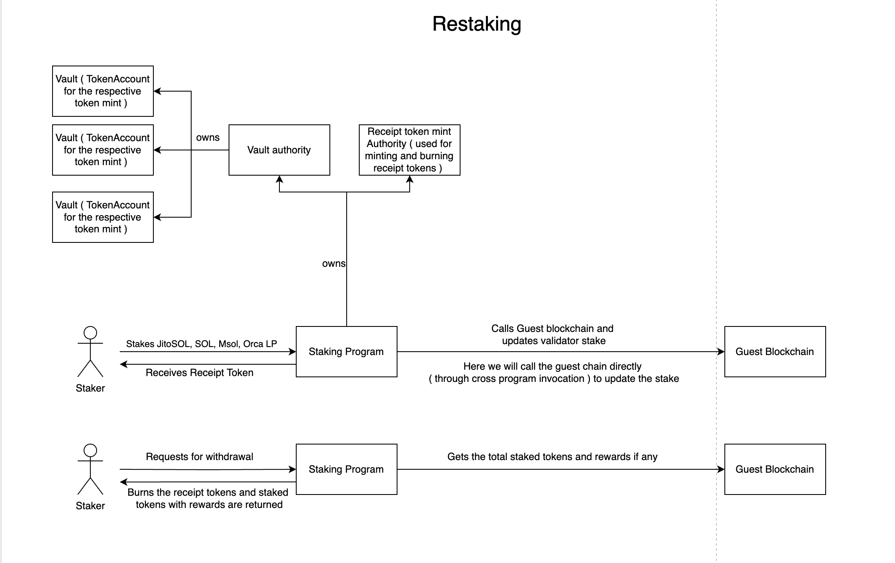

# Restaking

The high level flow of the program is given in the image below.

## Accounts
- Vaults: The vaults are created for each whitelisted token. Vaults are token accounts. The authority of the account is a PDA which means the program controls the vault and any debit from the vault has to go through the smart contract.
- Receipt Token Mint: The receipt token mint is a NFT which is the seed for the PDA storing information about stake amout, validator and rewards. 
- Staking Params: This is a PDA which stores the staking parameters and also is the authority to `Receipt Token Mint` and `Vaults`.
- Vault Params: PDA which stores the vault params which are stake time and service for which it is staked along with when rewards were claimed.

## Instructions

When the contract is deployed, the `initialize` method is called where the bounding period, whitelisted tokens and the admin key is set. Any update to the staking paramters can only be done by the admin key.
After that the users can start staking.

- `Deposit`: User can stake any of the whitelisted token. The tokens are stored in the vault and receipt tokens are minted for the user. A CPI (cross program invocation) call is made to the guest chain program where the stake is updated for the validator specified.

- `Withdraw`: Users can only withdraw their tokens after the bounding period. When user wants to withdraw the tokens, the rewards and the final stake amount is fetched from the guest chain. The receipt tokens are burnt and the rewards are returned to the user from the vault. A CPI call is made to the guest chain to update the stake accordingly.

- `Claim Rewards`: Users can claim rewards without withdrawing their stake. They would have to have to own the non fungible receipt token to be eligible for claiming rewards.

- `Update token Whitelist`: The admin can update the token whitelist. Only callable by admin set during `initialize` method.